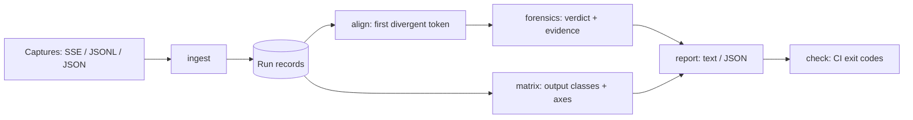

# seedproof

[English](README.md) | [中文](README.zh.md) | [日本語](README.ja.md)

[](LICENSE) [](CHANGELOG.md) [](pyproject.toml)  [](CONTRIBUTING.md)

**ローカル LLM 実行のためのオープンソース・トークンストリーム分岐フォレンジック——同じ seed なのに出力が違う？ backend や量子化をまたいで記録を比較し、最初に分岐したトークンを特定し、証拠付きで原因を示す。**


```bash
git clone https://github.com/JaydenCJ/seedproof && cd seedproof && pip install -e .
```

> **プレリリース：** seedproof はまだ PyPI に公開されていません。初回リリースまでは [JaydenCJ/seedproof](https://github.com/JaydenCJ/seedproof) をクローンし、リポジトリのルートで `pip install -e .` を実行してください。ランタイム依存はゼロなので、`PYTHONPATH=src python3 -m seedproof` ならインストールなしでも動きます。

## なぜ seedproof？

「同じ seed、同じモデルなのに出力が違う」はローカル推論界隈で最も議論され、最も診断されないバグ報告です——皆が手に取るツールが、間違った問いに答えているからです。生成テキストへの `diff` は信号を溺れさせます：トークンが 1 つ反転すればその後のすべてが狂うので、事件は 16 番目の位置での僅差の一回だったのに、diff は百行の変更を映します。評価ハーネスが判定するのは答えの*品質*であってバイト一致ではなく、しかもライブの再実行が必要です。テンソルレベルの checkpoint 比較は、量子化が違えば重みも違うと教えてくれるだけで——それは先刻承知——トークンストリームが実際に*どこで*分岐したのか、その反転が数値的なコイン投げだったのかは教えてくれません。seedproof は議論が実際に起きている層、つまり記録されたトークンストリームで働きます。手元にあるキャプチャ（SSE ストリーミング応答、JSONL トークンログ、JSON ダンプ）を取り込み、トークン id またはテキストで整列し、最初の分岐点を見つけ、対数確率の証拠で原因を分類します——重みも、サーバーも、再実行も不要です。

|  | seedproof | テキストへの `diff` | 評価ハーネス | テンソル比較ツール |
|---|---|---|---|---|
| 記録から動作、再実行不要 | Yes | Yes | No——ライブ実行が必要 | No——checkpoint が必要 |
| 最初に分岐した*トークン*を特定 | Yes | 行レベルのノイズ | No | No |
| *原因*を説明（僅差の反転か分布の移動か） | Yes、logprob の証拠 | No | No | よくて間接的 |
| N 回の実行を設定軸でクラス分け | Yes | No | No | No |
| 終了コード付きの CI ゲート | Yes（`check`） | 手作り | アサーション式 | No |
| ランタイム依存 | 0 | — | 数十個 | ML フレームワーク一式 |

<sub>比較は 2026-07 時点：典型的な評価ハーネスは数十のランタイムパッケージを入れ、実行ごとにライブのモデルエンドポイントを要します。テンソル比較ワークフローには checkpoint を生んだフレームワークが必要です。seedproof の数字は [pyproject.toml](pyproject.toml) の `dependencies = []` です。</sub>

## 主な機能

- **五十行の巻き添えではなく、最初の反転だけを見る** —— ストリームはトークン id で整列され（id がなければテキストにフォールバック）、レポートは正確なインデックス、前後のコンテキスト、両候補トークンを示し、分岐点に矢印を付けます。
- **原因を、証拠付きで** —— 十種類の判定を持つルールチェーン（`prompt-mismatch`、`tokenizer-boundary`、`seed-mismatch`、`sampler-config`、`model-mismatch`、`quant-numerics`、`backend-numerics`、`runtime-config`、`nondeterminism`、`identical`）。構造的な説明が数値的な推測より必ず先に立つ順序です。
- **証拠グレードの logprob 分析** —— 分岐点での僅差判定（敗者は 0.002 nats 差か 3 nats 差か？）、共有プレフィックス上のドリフト指標、再収束の検出。logprob の証拠がない判定は正直に `medium` 信頼度で頭打ちにします。
- **ペアだけでなくマトリクスで** —— N 件の記録を出力等価クラスに畳み込み、軸ごとの分析でどの設定フィールドが分裂を説明するかを示します。単独で説明できるフィールドがなければ、説明できる組み合わせを探します（`backend + quant together explain the split`）。
- **議論を終わらせる CI ゲート** —— `seedproof check runs/` は二つの実行が食い違った瞬間に終了コード 1 で落ちます。終了コードは `diff(1)` 流儀、機械向けには `--json` 出力。greedy と seed の言い伝えは、論争ではなくテストで決着します。
- **依存ゼロ・完全オフライン** —— キャプチャ済みの SSE ストリーム、JSONL トークンログ、JSON ダンプを取り込みます。すべて Python 標準ライブラリのみ、記録はキーをソートした素の JSON、どの段階でもネットワークには触れません。

## クイックスタート

インストールして、決定論的なデモマトリクスを生成します（自分のキャプチャの取り込みでも可）：

```bash
git clone https://github.com/JaydenCJ/seedproof && cd seedproof && pip install -e .
python3 examples/make_runs.py demo-runs
```

*同じ* seed の CPU 実行と GPU 実行がどこで、なぜ分岐したのかを尋ねます：

```bash
seedproof diff demo-runs/cpu-fp32-seed42.json demo-runs/cuda-fp32-seed42.json
```

出力（実際の実行からコピー、`...` で省略）：

```text
a: cpu-fp32-seed42  cpu  fp32  seed=42  greedy  48 tokens
b: cuda-fp32-seed42  cuda  fp32  seed=42  greedy  48 tokens

first divergent token: index 16  (basis: id)

    13  " horizon"   " horizon"
    14  " air"       " air"
    15  " sky"       " sky"
  > 16  " it"        " wavelength"  <- first divergence
    17  " small"     " and"
  ...

verdict: backend-numerics (confidence: high)
  same config on a different backend; first divergence at token 16: " it" vs " wavelength"
evidence:
  - [config] backend: "cpu" -> "cuda"
  - [tie-break] the losing token trailed the winner by only 0.0017 nats (<= epsilon 0.05) — a numerical tie-break
  - [prefix-drift] mean |dlogprob| 0.0042 over 16 shared tokens, max 0.0084 at token 0
  - [resync] streams never reconverge after the divergence
```

五つの実行をまとめて、どの軸が実際に出力を分けているのかを見ます：

```bash
seedproof matrix demo-runs
```

```text
prompt: 29a94f4916d0  basis: id  runs: 5  classes: 3

CLASS  RUNS  TOKENS  STREAM        MEMBERS
A      3     48      53c9a33756a4  cpu-fp32-rerun, cpu-fp32-seed42, cpu-fp32-seed7
B      1     48      45bec5aed400  cpu-q4-seed42
C      1     48      185c08abdbb9  cuda-fp32-seed42

varying config axes:
  backend      does not explain the split  ("cpu" -> A/B; "cuda" -> C)
  quant        does not explain the split  ("fp32" -> A/C; "q4_k_m" -> B)
  seed         does not explain the split  (42 -> A/B/C; 7 -> A)
  combined: backend + quant together explain the split

first divergence between classes:
  A vs B  token 17  " small" vs " color"
  A vs C  token 16  " it" vs " wavelength"
  B vs C  token 16  " it" vs " wavelength"
```

実キャプチャの取り込み（`curl -sN ... > capture.txt` で保存した OpenAI 互換のストリーミング応答）：

```bash
seedproof ingest capture.txt --format sse --backend cuda --quant q4_k_m \
  --seed 42 --prompt "Why is the sky blue?" -o run-gpu.json
seedproof check runs/   # CI gate: exit 1 unless every run matches
```

## 分岐判定リファレンス

| 判定 | 発火条件 | 補足 |
|---|---|---|
| `identical` | ストリームが当該 basis で一致 | 設定が違うのに出力が一致した場合は再現性の勝利として報告 |
| `prompt-mismatch` | prompt のハッシュが不一致 | すべてに優先：その二つの実行は比較不能 |
| `tokenizer-boundary` | デコード文字列は同じで分割や id が違う | 語彙の差であって挙動の差ではない |
| `seed-mismatch` | 確率的サンプリング下で seed が不一致 | greedy 実行が seed のせいにされることはない |
| `sampler-config` | temperature / top-k / top-p / sampler が不一致 | トークン選択規則そのものが違う |
| `model-mismatch` | モデル識別子が不一致 | 重みが違うので分岐は想定内 |
| `quant-numerics` | `quant` だけが不一致 | 証拠が僅差の反転と分布の移動を区別 |
| `backend-numerics` | `backend`/`device` だけが不一致 | GPU 対 CPU 論争のための判定 |
| `runtime-config` | 複数のランタイム軸が同時に不一致 | 自由形式の `extra.*` ノブも含む |
| `nondeterminism` | 設定が完全一致なのに出力が不一致 | アトミック演算・バッチ処理・スレッドスケジューリングを指す |

`diff` のオプションは `Key | Default | Effect` 形式です：

| Key | 既定値 | 効果 |
|---|---|---|
| `--basis` | `auto` | トークン id（`id`）、テキスト（`text`）、id があれば id（`auto`）で比較 |
| `--context` | `3` | 分岐点の前後に表示するコンテキストのトークン数 |
| `--tie-epsilon` | `0.05` | 同点とみなす logprob 差の上限（nats） |
| `--json` | off | 同じフィールドを持つ機械可読の診断を出力 |

記録スキーマ（実行ごとに 1 つの JSON、改竄検知の prompt ハッシュ、任意の id/logprob/top-k）は [`docs/record-format.md`](docs/record-format.md) に、キャプチャアダプタは `sse`、`jsonl`、`generic`（[`examples/`](examples/) 参照）にあります。

## 検証

このリポジトリは CI を同梱しません。上記の主張はすべてローカル実行で検証されています。このリポジトリのチェックアウトから再現できます：

```bash
pip install -e '.[dev]' && pytest && bash scripts/smoke.sh
```

出力（実際の実行からコピー、`...` で省略）：

```text
90 passed in 0.50s
...
[matrix]   combined: backend + quant together explain the split
SMOKE OK
```

## アーキテクチャ



## ロードマップ

- [x] 記録フォーマット、三種の取り込みアダプタ、整列エンジン、十判定フォレンジック、実行マトリクス、CI ゲート、フル CLI（v0.1.0）
- [ ] PyPI 公開（`pip install seedproof`）
- [ ] 主要なローカル推論サーバー向けネイティブキャプチャシム（slot/token ログ）
- [ ] サンプラーリプレイ：記録された seed から RNG 系列を再導出し確率的な選択を検証
- [ ] トークン単位のドリフトヒートマップ付き HTML レポート

全リストは [open issues](https://github.com/JaydenCJ/seedproof/issues) を参照してください。

## コントリビュート

コントリビュート歓迎です——まずは [good first issue](https://github.com/JaydenCJ/seedproof/issues?q=is%3Aissue+is%3Aopen+label%3A%22good+first+issue%22) から、あるいは [discussion](https://github.com/JaydenCJ/seedproof/discussions) を立ててください。開発環境の構築は [CONTRIBUTING.md](CONTRIBUTING.md) を参照。

## ライセンス

[MIT](LICENSE)
