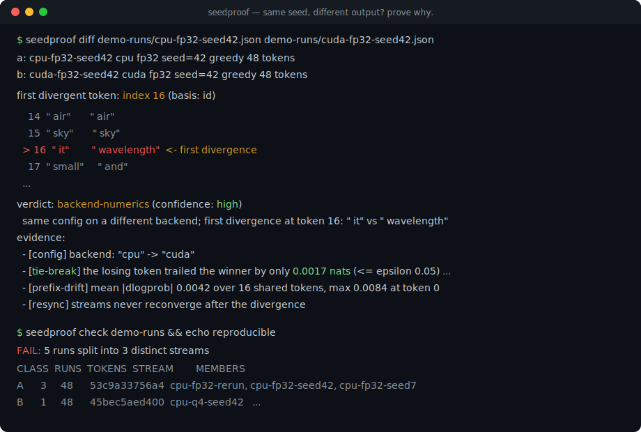
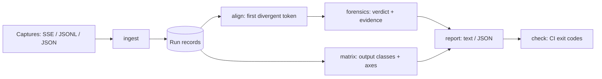

# seedproof

[English](README.md) | [中文](README.zh.md) | [日本語](README.ja.md)

[](LICENSE) [](CHANGELOG.md) [](pyproject.toml)  [](CONTRIBUTING.md)

**Open-source token-stream divergence forensics for local LLM runs — same seed, different output? Compare recordings across backends and quants, pinpoint the first divergent token, and get the cause with evidence.**



```bash
git clone https://github.com/JaydenCJ/seedproof && cd seedproof && pip install -e .
```

> **Pre-release:** seedproof is not yet published to PyPI. Until the first release, clone [JaydenCJ/seedproof](https://github.com/JaydenCJ/seedproof) and run `pip install -e .` from the repository root. The tool has zero runtime dependencies, so `PYTHONPATH=src python3 -m seedproof` works without installing anything.

## Why seedproof?

"Same seed, same model, different output" is the most-argued bug report in local inference — and the least-diagnosed, because the tools people reach for answer the wrong question. `diff` on the generated text drowns the signal: one flipped token derails everything after it, so the diff shows a hundred changed lines when the event was one near-tie at position 16. Eval harnesses judge answer *quality*, not byte equality, and need live re-runs. Tensor-level checkpoint diffing tells you the weights differ across quants — you knew that — not *where* the token stream actually forked or whether the flip was a numerical coin toss. seedproof works at the layer where the argument lives: the recorded token stream. It consumes captures you already have (streamed SSE responses, JSONL token logs, JSON dumps), aligns them by token id or text, finds the first fork, and classifies the cause with log-probability evidence — no weights, no server, no re-run.

|  | seedproof | `diff` on text | eval harnesses | tensor diff tools |
|---|---|---|---|---|
| Works from recordings, no re-run needed | Yes | Yes | No — live runs | No — checkpoints |
| Pinpoints the first divergent *token* | Yes | Line-level noise | No | No |
| Says *why* (tie-break vs distribution shift) | Yes, logprob evidence | No | No | Indirect at best |
| Groups N runs into classes by config axis | Yes | No | No | No |
| CI gate with exit codes | Yes (`check`) | Ad hoc | Assertion-based | No |
| Runtime dependencies | 0 | — | Dozens | Full ML framework |

<sub>Comparison as of 2026-07: typical eval harnesses install dozens of runtime packages and need a live model endpoint per run; tensor-diff workflows require the framework that produced the checkpoint. seedproof's count is `dependencies = []` in [pyproject.toml](pyproject.toml).</sub>

## Features

- **The first flip, not fifty lines of fallout** — streams are aligned by token id (or text as fallback) and the report shows the exact index, a context window, and both candidate tokens with a caret on the fork.
- **Cause, with receipts** — a ten-verdict rule chain (`prompt-mismatch`, `tokenizer-boundary`, `seed-mismatch`, `sampler-config`, `model-mismatch`, `quant-numerics`, `backend-numerics`, `runtime-config`, `nondeterminism`, `identical`) ordered so structural explanations beat numerical guesses.
- **Evidence-grade logprobs** — near-tie analysis at the flip (did the loser trail by 0.002 nats or by 3?), drift metrics along the shared prefix, and reconvergence detection; verdicts without logprob evidence are honestly capped at `medium` confidence.
- **Run matrices, not just pairs** — N records collapse into output-equivalence classes; per-axis analysis states which config field explains the split, and when no single field does, seedproof finds the pair that does (`backend + quant together explain the split`).
- **A CI gate that settles arguments** — `seedproof check runs/` exits 1 the moment two runs disagree, with `diff(1)`-style exit codes and `--json` output for machines; greedy-vs-seed folklore gets tested, not debated.
- **Zero dependencies, fully offline** — ingest captured SSE streams, JSONL token logs, or JSON dumps; everything is Python standard library, records are plain sorted-key JSON, and nothing ever touches the network.

## Quickstart

Install, then generate the deterministic demo matrix (or ingest your own captures):

```bash
git clone https://github.com/JaydenCJ/seedproof && cd seedproof && pip install -e .
python3 examples/make_runs.py demo-runs
```

Ask where the CPU and GPU runs of the *same* seed forked, and why:

```bash
seedproof diff demo-runs/cpu-fp32-seed42.json demo-runs/cuda-fp32-seed42.json
```

Output (copied from a real run, truncated with `...`):

```text
a: cpu-fp32-seed42  cpu  fp32  seed=42  greedy  48 tokens
b: cuda-fp32-seed42  cuda  fp32  seed=42  greedy  48 tokens

first divergent token: index 16  (basis: id)

    13  " horizon"   " horizon"
    14  " air"       " air"
    15  " sky"       " sky"
  > 16  " it"        " wavelength"  <- first divergence
    17  " small"     " and"
  ...

verdict: backend-numerics (confidence: high)
  same config on a different backend; first divergence at token 16: " it" vs " wavelength"
evidence:
  - [config] backend: "cpu" -> "cuda"
  - [tie-break] the losing token trailed the winner by only 0.0017 nats (<= epsilon 0.05) — a numerical tie-break
  - [prefix-drift] mean |dlogprob| 0.0042 over 16 shared tokens, max 0.0084 at token 0
  - [resync] streams never reconverge after the divergence
```

Group all five runs and see which axis actually splits the outputs:

```bash
seedproof matrix demo-runs
```

```text
prompt: 29a94f4916d0  basis: id  runs: 5  classes: 3

CLASS  RUNS  TOKENS  STREAM        MEMBERS
A      3     48      53c9a33756a4  cpu-fp32-rerun, cpu-fp32-seed42, cpu-fp32-seed7
B      1     48      45bec5aed400  cpu-q4-seed42
C      1     48      185c08abdbb9  cuda-fp32-seed42

varying config axes:
  backend      does not explain the split  ("cpu" -> A/B; "cuda" -> C)
  quant        does not explain the split  ("fp32" -> A/C; "q4_k_m" -> B)
  seed         does not explain the split  (42 -> A/B/C; 7 -> A)
  combined: backend + quant together explain the split

first divergence between classes:
  A vs B  token 17  " small" vs " color"
  A vs C  token 16  " it" vs " wavelength"
  B vs C  token 16  " it" vs " wavelength"
```

Ingest a real capture (an OpenAI-compatible streaming response saved with `curl -sN ... > capture.txt`):

```bash
seedproof ingest capture.txt --format sse --backend cuda --quant q4_k_m \
  --seed 42 --prompt "Why is the sky blue?" -o run-gpu.json
seedproof check runs/   # CI gate: exit 1 unless every run matches
```

## Divergence verdicts

| Verdict | Fires when | Note |
|---|---|---|
| `identical` | streams match on the basis | config deltas with matching output are reported as a reproducibility win |
| `prompt-mismatch` | prompt hashes differ | wins over everything: the runs are not comparable |
| `tokenizer-boundary` | same decoded text, different segmentation or ids | a vocab difference, not a behavior difference |
| `seed-mismatch` | seeds differ under stochastic sampling | greedy runs never blame the seed |
| `sampler-config` | temperature / top-k / top-p / sampler differ | different token-picking rules |
| `model-mismatch` | model identifiers differ | different weights, expected divergence |
| `quant-numerics` | only `quant` differs | evidence separates tie-break from distribution shift |
| `backend-numerics` | only `backend`/`device` differ | the GPU-vs-CPU verdict |
| `runtime-config` | several runtime axes differ at once | including free-form `extra.*` knobs |
| `nondeterminism` | configs are identical yet outputs differ | points at atomics, batching, thread scheduling |

`diff` options follow `Key | Default | Effect`:

| Key | Default | Effect |
|---|---|---|
| `--basis` | `auto` | compare token ids (`id`), texts (`text`), or ids-when-available (`auto`) |
| `--context` | `3` | tokens of context shown around the divergence |
| `--tie-epsilon` | `0.05` | logprob gap (nats) at or under which candidates count as tied |
| `--json` | off | machine-readable diagnosis with the same fields |

The record schema (one JSON file per run, tamper-detecting prompt hash, optional ids/logprobs/top-k) is documented in [`docs/record-format.md`](docs/record-format.md); capture adapters are `sse`, `jsonl`, and `generic` (see [`examples/`](examples/)).

## Verification

This repository ships no CI; every claim above is verified by local runs. Reproduce them from a checkout of this repository:

```bash
pip install -e '.[dev]' && pytest && bash scripts/smoke.sh
```

Output (copied from a real run, truncated with `...`):

```text
90 passed in 0.50s
...
[matrix]   combined: backend + quant together explain the split
SMOKE OK
```

## Architecture



## Roadmap

- [x] Record format, three ingest adapters, alignment engine, ten-verdict forensics, run matrix, CI gate, full CLI (v0.1.0)
- [ ] PyPI release with `pip install seedproof`
- [ ] Native capture shims for popular local inference servers (slot/token logs)
- [ ] Sampler replay: re-derive the RNG chain from the recorded seed to verify a stochastic pick
- [ ] HTML report with a per-token drift heatmap

See the [open issues](https://github.com/JaydenCJ/seedproof/issues) for the full list.

## Contributing

Contributions are welcome — start with a [good first issue](https://github.com/JaydenCJ/seedproof/issues?q=is%3Aissue+is%3Aopen+label%3A%22good+first+issue%22) or open a [discussion](https://github.com/JaydenCJ/seedproof/discussions). See [CONTRIBUTING.md](CONTRIBUTING.md) for the development setup.

## License

[MIT](LICENSE)
