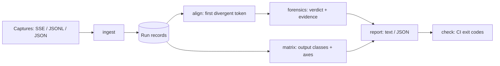

# seedproof

[English](README.md) | [中文](README.zh.md) | [日本語](README.ja.md)

[](LICENSE) [](CHANGELOG.md) [](pyproject.toml)  [](CONTRIBUTING.md)

**面向本地 LLM 运行的开源 token 流分叉取证工具——同一个 seed 却输出不同？跨 backend、跨量化对比录制结果，定位第一个分叉 token，并给出有证据的原因。**


```bash
git clone https://github.com/JaydenCJ/seedproof && cd seedproof && pip install -e .
```

> **预发布：** seedproof 尚未发布到 PyPI。首个正式版之前，请克隆 [JaydenCJ/seedproof](https://github.com/JaydenCJ/seedproof) 并在仓库根目录执行 `pip install -e .`。本工具零运行时依赖，因此 `PYTHONPATH=src python3 -m seedproof` 无需安装即可运行。

## 为什么选 seedproof？

“同一个 seed、同一个模型、输出却不同”是本地推理圈争论最多、也最缺诊断手段的 bug 报告——因为大家顺手抓起的工具回答的都是错误的问题。对生成文本跑 `diff` 会淹没信号：一个 token 翻转会带偏其后的一切，事件本来只是第 16 个位置上的一次险胜，diff 却显示上百行改动。评测框架评判的是答案*质量*而非字节一致性，还需要在线重跑。张量级 checkpoint 对比只能告诉你不同量化下权重不同——这你早知道了——而不是 token 流究竟在*哪里*分叉、那次翻转是不是一次数值上的掷硬币。seedproof 工作在争论真正发生的层面：录制下来的 token 流。它消费你手头已有的捕获（SSE 流式响应、JSONL token 日志、JSON 转储），按 token id 或文本对齐，找到第一个分叉点，并用对数概率证据归类原因——不需要权重、不需要服务器、不需要重跑。

|  | seedproof | 对文本跑 `diff` | 评测框架 | 张量对比工具 |
|---|---|---|---|---|
| 基于录制工作，无需重跑 | 是 | 是 | 否——需要在线运行 | 否——需要 checkpoint |
| 精确定位第一个分叉 *token* | 是 | 行级噪音 | 否 | 否 |
| 说明*原因*（险胜翻转还是分布位移） | 是，logprob 证据 | 否 | 否 | 至多间接推断 |
| 按配置轴把 N 次运行分组归类 | 是 | 否 | 否 | 否 |
| 带退出码的 CI 门禁 | 是（`check`） | 手工拼凑 | 断言式 | 否 |
| 运行时依赖 | 0 | — | 数十个 | 完整 ML 框架 |

<sub>对比截至 2026-07：典型评测框架会安装数十个运行时包且每次运行都需要在线模型端点；张量对比流程需要产出该 checkpoint 的框架。seedproof 的数字是 [pyproject.toml](pyproject.toml) 里的 `dependencies = []`。</sub>

## 功能特性

- **只看第一次翻转，而非五十行连锁反应** —— 流按 token id 对齐（缺 id 时退回文本），报告给出精确下标、上下文窗口、两个候选 token，并用箭头标出分叉点。
- **给原因，还给凭据** —— 十种裁定的规则链（`prompt-mismatch`、`tokenizer-boundary`、`seed-mismatch`、`sampler-config`、`model-mismatch`、`quant-numerics`、`backend-numerics`、`runtime-config`、`nondeterminism`、`identical`），顺序保证结构性解释优先于数值猜测。
- **证据级 logprob 分析** —— 分叉点的险胜分析（输家落后 0.002 nats 还是 3 nats？）、共享前缀上的漂移指标、重新收敛检测；缺少 logprob 证据的裁定诚实地封顶为 `medium` 置信度。
- **矩阵分析，不止两两对比** —— N 条记录折叠成输出等价类；逐轴分析指出哪个配置字段解释了分裂，单个字段解释不了时，seedproof 会找出能解释的字段组合（`backend + quant together explain the split`）。
- **能终结争论的 CI 门禁** —— `seedproof check runs/` 在任意两次运行不一致的瞬间以退出码 1 失败，退出码遵循 `diff(1)` 惯例并提供机器可读的 `--json` 输出；greedy 与 seed 的江湖传说从此靠测试而非争吵解决。
- **零依赖、完全离线** —— 摄取捕获的 SSE 流、JSONL token 日志或 JSON 转储；全部只用 Python 标准库，记录是键排序的纯 JSON，任何环节都不触网。

## 快速上手

安装后生成确定性的演示矩阵（或摄取你自己的捕获）：

```bash
git clone https://github.com/JaydenCJ/seedproof && cd seedproof && pip install -e .
python3 examples/make_runs.py demo-runs
```

问一问*同一个* seed 的 CPU 与 GPU 运行在哪里分叉、为什么：

```bash
seedproof diff demo-runs/cpu-fp32-seed42.json demo-runs/cuda-fp32-seed42.json
```

输出（复制自真实运行，用 `...` 截断）：

```text
a: cpu-fp32-seed42  cpu  fp32  seed=42  greedy  48 tokens
b: cuda-fp32-seed42  cuda  fp32  seed=42  greedy  48 tokens

first divergent token: index 16  (basis: id)

    13  " horizon"   " horizon"
    14  " air"       " air"
    15  " sky"       " sky"
  > 16  " it"        " wavelength"  <- first divergence
    17  " small"     " and"
  ...

verdict: backend-numerics (confidence: high)
  same config on a different backend; first divergence at token 16: " it" vs " wavelength"
evidence:
  - [config] backend: "cpu" -> "cuda"
  - [tie-break] the losing token trailed the winner by only 0.0017 nats (<= epsilon 0.05) — a numerical tie-break
  - [prefix-drift] mean |dlogprob| 0.0042 over 16 shared tokens, max 0.0084 at token 0
  - [resync] streams never reconverge after the divergence
```

把五次运行放进一个矩阵，看看到底是哪条轴把输出分开了：

```bash
seedproof matrix demo-runs
```

```text
prompt: 29a94f4916d0  basis: id  runs: 5  classes: 3

CLASS  RUNS  TOKENS  STREAM        MEMBERS
A      3     48      53c9a33756a4  cpu-fp32-rerun, cpu-fp32-seed42, cpu-fp32-seed7
B      1     48      45bec5aed400  cpu-q4-seed42
C      1     48      185c08abdbb9  cuda-fp32-seed42

varying config axes:
  backend      does not explain the split  ("cpu" -> A/B; "cuda" -> C)
  quant        does not explain the split  ("fp32" -> A/C; "q4_k_m" -> B)
  seed         does not explain the split  (42 -> A/B/C; 7 -> A)
  combined: backend + quant together explain the split

first divergence between classes:
  A vs B  token 17  " small" vs " color"
  A vs C  token 16  " it" vs " wavelength"
  B vs C  token 16  " it" vs " wavelength"
```

摄取一份真实捕获（用 `curl -sN ... > capture.txt` 保存的 OpenAI 兼容流式响应）：

```bash
seedproof ingest capture.txt --format sse --backend cuda --quant q4_k_m \
  --seed 42 --prompt "Why is the sky blue?" -o run-gpu.json
seedproof check runs/   # CI gate: exit 1 unless every run matches
```

## 分叉裁定一览

| 裁定 | 触发条件 | 备注 |
|---|---|---|
| `identical` | 流在该 basis 上完全一致 | 配置不同但输出一致会被报告为一次可复现性胜利 |
| `prompt-mismatch` | prompt 哈希不同 | 压倒一切：两次运行不可比 |
| `tokenizer-boundary` | 解码文本相同但切分或 id 不同 | 是词表差异，不是行为差异 |
| `seed-mismatch` | 随机采样下 seed 不同 | greedy 运行永远不会归咎于 seed |
| `sampler-config` | temperature / top-k / top-p / sampler 不同 | 选 token 的规则本身不同 |
| `model-mismatch` | 模型标识不同 | 权重不同，分叉是预期内的 |
| `quant-numerics` | 仅 `quant` 不同 | 证据区分险胜翻转与分布位移 |
| `backend-numerics` | 仅 `backend`/`device` 不同 | GPU 对 CPU 之争的那个裁定 |
| `runtime-config` | 多条运行时轴同时不同 | 包括自由形式的 `extra.*` 开关 |
| `nondeterminism` | 配置完全相同输出却不同 | 指向原子归约、批处理、线程调度 |

`diff` 选项遵循 `Key | Default | Effect`：

| Key | 默认值 | 作用 |
|---|---|---|
| `--basis` | `auto` | 按 token id（`id`）、文本（`text`）或有 id 就用 id（`auto`）对比 |
| `--context` | `3` | 分叉点前后显示的上下文 token 数 |
| `--tie-epsilon` | `0.05` | 视为平手的 logprob 差距上限（nats） |
| `--json` | 关 | 输出字段相同的机器可读诊断 |

记录格式（每次运行一个 JSON 文件、防篡改 prompt 哈希、可选 id/logprob/top-k）见 [`docs/record-format.md`](docs/record-format.md)；捕获适配器有 `sse`、`jsonl`、`generic`（见 [`examples/`](examples/)）。

## 验证

本仓库不附带 CI；上文的每一条主张都由本地运行验证。从本仓库的检出即可复现：

```bash
pip install -e '.[dev]' && pytest && bash scripts/smoke.sh
```

输出（复制自真实运行，用 `...` 截断）：

```text
90 passed in 0.50s
...
[matrix]   combined: backend + quant together explain the split
SMOKE OK
```

## 架构



## 路线图

- [x] 记录格式、三种摄取适配器、对齐引擎、十裁定取证、运行矩阵、CI 门禁、完整 CLI（v0.1.0）
- [ ] 发布到 PyPI，支持 `pip install seedproof`
- [ ] 为主流本地推理服务器提供原生捕获垫片（slot/token 日志）
- [ ] 采样器重放：根据记录的 seed 重推 RNG 链，验证一次随机选取
- [ ] 带逐 token 漂移热力图的 HTML 报告

完整列表见 [open issues](https://github.com/JaydenCJ/seedproof/issues)。

## 参与贡献

欢迎贡献——可以从 [good first issue](https://github.com/JaydenCJ/seedproof/issues?q=is%3Aissue+is%3Aopen+label%3A%22good+first+issue%22) 入手，或发起一个 [discussion](https://github.com/JaydenCJ/seedproof/discussions)。开发环境搭建见 [CONTRIBUTING.md](CONTRIBUTING.md)。

## 许可证

[MIT](LICENSE)
